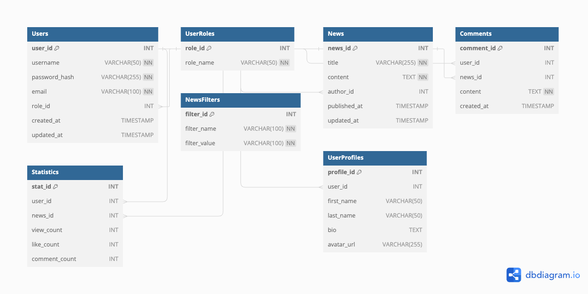

# News Application Database
## Schema

## Tables
- Users: Stores user information such as username, password hash, email, role, and timestamps for creation and updates.
- UserRoles: Contains the available roles for users.
- News: Stores news article details including title, content, author, and timestamps for publication and updates. It has a foreign key relationship with the Users table.
- Comments: Stores user comments on news articles, including the user ID, news ID, content, and creation timestamp. It has foreign key relationships with the Users and News tables.
- Statistics: Stores statistics related to news articles, including the user ID, news ID, view count, like count, and comment count. It has foreign key relationships with the Users and News tables.
NewsFilters: Contains filters for news articles, including the filter name and value.
- UserProfiles: Stores user profile information such as first name, last name, bio, and avatar URL. It has a foreign key relationship with the Users table.
## Relationships and Constraints
- The Users table has a foreign key constraint with the UserRoles table, linking the role ID.
- The News table has a foreign key constraint with the Users table, linking the author ID.
- The Comments table has foreign key constraints with the Users and News tables, linking the user ID and news ID.
- The Statistics table has foreign key constraints with the Users and News tables, linking the user ID and news ID.
- The UserProfiles table has a foreign key constraint with the Users table, linking the user ID.
